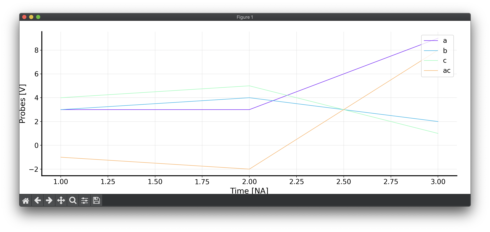

# hwpwn
Hardware pwning tool

# Installation

    pip install hwpwn

# Userguide

Let's start by creating a dummy data file. The first axis (usually time but not necessary) is assumed to be the
first column. The first row is the header, containing the column names.

    $ cat <<EOF > test.csv
    t,a,b,c
    1,3,3,4
    2,3,4,5
    3,9,2,1
    EOF

Let's make hwpwn read this data and dump it:

    $ hwpwn data load test.csv | cat
    {"x_axis": [1.0, 2.0, 3.0], "signals": [{"name": "a", "vector": [3.0, 3.0, 9.0]}, 
    {"name": "b", "vector": [3.0, 4.0, 2.0]}, {"name": "c", "vector": [4.0, 5.0, 1.0]}], 
    "triggers": [], "ts": 1}

It will only output data of the last command if there is a pipe command. The hwpwn was designed in a way that one can
pipe multiple commands in chain, or provide a flow configuration file with the sequence of commands in YAML format.

So, let's say we want to subtract vector `a` and `c`, store the result in `ac` and dump the result.

    $ hwpwn data load test.csv | hwpwn data subtract a c ac --append | cat
    {"x_axis": [1.0, 2.0, 3.0], "signals": [{"name": "a", "vector": [3.0, 3.0, 9.0]}, 
    {"name": "b", "vector": [3.0, 4.0, 2.0]}, {"name": "c", "vector": [4.0, 5.0, 1.0]}, 
    {"name": "ac", "vector": [-1.0, -2.0, 8.0]}], "triggers": [], "ts": 1}

The `--append` means it will add a new signal to the list instead of creating a new list of signals. Now this looks
good, but how can we plot it?

    $ hwpwn data load test.csv | hwpwn data subtract a c ac --append | hwpwn plot time --ylabel Probes --yunit V

Which should show the window as in the following screenshot.

For more information about the commands please use the `--help`.
